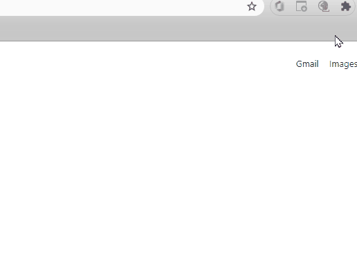

# RequestSAVM

This is a dummy extension I created just to learn how Chrome extensions work. I wanted to automate something, so I automated 3 every-day clicks, saving 1 minute per day or 17 hours per year.

It works on Chromium Edge too.

## Setup

1) Download source code to local machine.
2) Go to Chrome extensions: Put this URL chrome://extensions/
3) Toggle Developer mode on right upper corner.
4) Click 'Load unpacked' and select the folder with the source code. Make sure to pin the extension.

## Usage

1) Click on the extension icon on the right upper corner and wait for the action to happen.

## Limitations

It will only work for new VMs. 
If there is already a VM requested or available, you can click on the VM and the extension will download it (without having to click on Connect).

If the Front End code (React) is changed by the team, it will easily break it. :')
